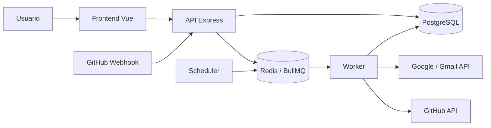

# BitCraft.com

BitCraft es una plataforma web distribuida para crear y ejecutar automatizaciones entre distintos servicios externos.

La aplicación permite conectar cuentas mediante OAuth, crear automatizaciones con condiciones y acciones secuenciales, ejecutarlas de forma asíncrona mediante BullMQ y Redis, y consultar posteriormente el historial de ejecuciones.

---

## Tecnologías

### Frontend

- Vue 3
- Vue Router
- Axios
- Vite

### Backend

- Node.js
- Express
- PostgreSQL
- JWT
- OAuth 2.0

### Procesamiento asíncrono

- BullMQ
- Redis
- Worker independiente
- Scheduler independiente

### Integraciones

- Google OAuth
- Gmail API
- GitHub OAuth
- GitHub REST API
- GitHub Webhooks

---

# Arquitectura

BitCraft utiliza una arquitectura distribuida en la que el servidor web no ejecuta directamente las automatizaciones.



El flujo general es:

1. El usuario configura una automatización desde el frontend.
2. La configuración se almacena en PostgreSQL.
3. Un evento o una programación genera una ejecución.
4. La ejecución se publica en Redis mediante BullMQ.
5. El Worker consume el trabajo.
6. Se evalúan las condiciones.
7. Las acciones se ejecutan secuencialmente.
8. El resultado se almacena en PostgreSQL.
9. El usuario puede consultar el historial desde la aplicación.

---

# Estructura del proyecto

```text
BitCraft/
│
├── apps/
│   ├── frontend/
│   │   └── Aplicación Vue 3
│   │
│   ├── web/
│   │   └── API REST y endpoints OAuth/Webhook
│   │
│   ├── worker/
│   │   └── Procesamiento asíncrono de automatizaciones
│   │
│   └── scheduler/
│       └── Ejecución de automatizaciones programadas
│
├── database/
│   └── Scripts y procedimientos de PostgreSQL
│
├── packages/
│   ├── providers/
│   │   └── Adaptadores para Google y GitHub
│   │
│   ├── queue/
│   │   └── Configuración relacionada con mensajería
│   │
│   └── shared/
│       └── Código compartido
│
├── prisma/
│
├── docker-compose.yml
├── .env.example
├── package.json
└── README.md
```

---

# Funcionalidades principales

## Autenticación

La plataforma permite:

- Registro de usuarios.
- Inicio de sesión.
- Cierre de sesión.
- Autenticación mediante JWT.
- Aislamiento de información por usuario.

---

## Conexiones OAuth

Actualmente se incluyen dos proveedores:

### Google

Permite conectar una cuenta de Google y utilizar Gmail para enviar correos desde una automatización.

### GitHub

Permite conectar una cuenta de GitHub para ejecutar acciones sobre repositorios.

Las credenciales OAuth se almacenan de forma protegida y no deben guardarse directamente en el repositorio.

---

# Automatizaciones

Cada automatización puede contener:

- Un disparador.
- Cero o más condiciones.
- Una o más acciones.
- Acciones ejecutadas secuencialmente.

Los valores de eventos y acciones anteriores pueden utilizarse posteriormente mediante interpolación.

Ejemplos:

```text
{{trigger.issue.title}}
```

```text
{{steps.1.issueNumber}}
```

---

# Disparadores

BitCraft soporta dos tipos principales de disparadores.

## Eventos

Actualmente se soportan eventos provenientes de GitHub mediante Webhooks.

Endpoint local:

```text
POST http://localhost:3000/api/webhooks/github
```

El webhook valida la firma HMAC enviada por GitHub utilizando:

```env
GITHUB_WEBHOOK_SECRET
```

Actualmente puede utilizarse el evento de creación de issues para iniciar automatizaciones.

---

## Programaciones

Las automatizaciones también pueden ejecutarse mediante una expresión cron.

El servicio:

```text
apps/scheduler
```

consulta las automatizaciones programadas activas y las publica en BullMQ en el momento correspondiente.

La zona horaria utilizada por el scheduler es:

```text
America/Costa_Rica
```

---

# Acciones disponibles

Actualmente se implementan al menos las siguientes acciones:

### Google / Gmail

```text
send_email
```

Permite enviar un correo electrónico.

### GitHub

```text
create_issue
```

Permite crear un issue en un repositorio.

```text
add_comment
```

Permite agregar un comentario a un issue existente.

---

# Ejecución asíncrona

Las automatizaciones no se procesan directamente dentro de una solicitud HTTP.

BitCraft utiliza:

```text
Redis
   ↓
BullMQ
   ↓
Worker
```

El servidor o scheduler crean el trabajo y lo publican en la cola:

```text
automation-execution
```

El Worker independiente consume los trabajos y ejecuta las acciones.

---

# Idempotencia

BitCraft implementa idempotencia tanto a nivel de ejecución como de acción.

Esto evita repetir operaciones externas cuando BullMQ vuelve a ejecutar un trabajo.

Por ejemplo:

```text
Acción 1 → enviar correo ✅

Acción 2 → crear issue ❌
```

Si la segunda acción falla y el trabajo debe reintentarse:

```text
Reintento:

Acción 1 → ya completada, se omite
Acción 2 → se vuelve a ejecutar
```

El estado de las acciones se almacena en:

```text
automation_action_executions
```

---

# Reintentos y Backoff

Los trabajos utilizan hasta:

```text
3 intentos
```

BitCraft incluye manejo especial de errores de proveedores externos.

### Errores temporales

Ejemplos:

```text
429 Too Many Requests
500 Internal Server Error
502 Bad Gateway
503 Service Unavailable
504 Gateway Timeout
```

Estos errores pueden reintentarse.

Cuando el proveedor devuelve:

```text
Retry-After
```

el Worker utiliza el tiempo indicado por el proveedor.

Cuando no existe un tiempo específico se utiliza backoff exponencial.

Ejemplo:

```text
Intento 1
↓
2 segundos
↓
Intento 2
↓
4 segundos
↓
Intento 3
```

---

# Errores permanentes

Los errores que no pueden resolverse mediante un nuevo intento no consumen innecesariamente todos los intentos configurados.

Ejemplo:

```text
GitHub 404 Not Found
```

El Worker lo clasifica como error permanente y termina la ejecución.

---

# Dead Letter Queue

Cuando una ejecución falla definitivamente se envía a:

```text
automation-execution-dlq
```

La DLQ conserva información como:

- ID de la ejecución.
- ID de la automatización.
- Usuario.
- Datos de entrada.
- Error.
- Cantidad de intentos.
- Fecha del fallo.

Esto permite conservar las ejecuciones fallidas para análisis o recuperación posterior.

---

# Historial de ejecuciones

La aplicación incluye una sección de historial donde el usuario puede consultar:

- Automatización.
- Estado.
- Fecha de ejecución.
- Cantidad de intentos.
- Duración.
- Datos de entrada.
- Datos de salida.
- Mensajes de error.
- Idempotency Key.

Cada usuario solamente puede consultar las ejecuciones correspondientes a sus propias automatizaciones.

---

# Requisitos

Para ejecutar el proyecto se necesita:

- Node.js
- npm
- PostgreSQL
- Docker
- Docker Compose

Redis puede ejecutarse mediante Docker utilizando el archivo incluido en el proyecto.

---

# Instalación

Clonar el repositorio:

```bash
git clone <URL_DEL_REPOSITORIO>
```

Entrar al proyecto:

```bash
cd BitCraft
```

Instalar las dependencias raíz:

```bash
npm install
```

Instalar las dependencias del frontend:

```bash
npm --prefix apps/frontend install
```

Instalar las dependencias del backend:

```bash
npm --prefix apps/web install
```

Instalar las dependencias del scheduler:

```bash
npm --prefix apps/scheduler install
```

Instalar las dependencias del worker si corresponde a su configuración local:

```bash
cd apps/worker
npm install
cd ../..
```

---

# Variables de entorno

Copiar:

```text
.env.example
```

como:

```text
.env
```

En Git Bash:

```bash
cp .env.example .env
```

Configuración base:

```env
PORT=3000

DB_HOST=localhost
DB_PORT=5432
DB_NAME=BitCraft
DB_USER=postgres
DB_PASSWORD=your_database_password

JWT_SECRET=your_jwt_secret
JWT_EXPIRES_IN=1h
COOKIE_NAME=bitcraft_token

OAUTH_ENCRYPTION_KEY=your_oauth_encryption_key

GOOGLE_CLIENT_ID=your_google_client_id
GOOGLE_CLIENT_SECRET=your_google_client_secret
GOOGLE_REDIRECT_URI=http://localhost:3000/api/connections/google/callback

GITHUB_CLIENT_ID=your_github_client_id
GITHUB_CLIENT_SECRET=your_github_client_secret
GITHUB_REDIRECT_URI=http://localhost:3000/api/connections/github/callback

REDIS_HOST=127.0.0.1
REDIS_PORT=6379

GITHUB_WEBHOOK_SECRET=your_github_webhook_secret
```

Nunca se debe subir el archivo `.env` al repositorio.

---

# PostgreSQL

BitCraft utiliza PostgreSQL para almacenar:

- Usuarios.
- Conexiones OAuth.
- Automatizaciones.
- Condiciones.
- Acciones.
- Ejecuciones.
- Estado individual de cada acción.
- Historial de ejecuciones.

Crear una base de datos llamada:

```text
BitCraft
```

Todos los scripts necesarios se encuentran en:

```text
database/
```

## Inicialización de la base de datos

Ejecutar los archivos SQL en el siguiente orden:

```text
1. tablas.sql
2. procedures_users.sql
3. procedures_service_connections.sql
4. procedures_automations.sql
5. procedures_automation_executions.sql
6. procedures_automation_action_executions.sql
```

Primero se crean las tablas y posteriormente los procedimientos almacenados utilizados por la aplicación.

### Scripts disponibles

```text
database/
├── tablas.sql
├── procedures_users.sql
├── procedures_service_connections.sql
├── procedures_automations.sql
├── procedures_automation_executions.sql
└── procedures_automation_action_executions.sql
```

### Descripción

`tablas.sql`

Crea la estructura principal de la base de datos, incluyendo usuarios, conexiones, automatizaciones, condiciones, acciones y ejecuciones.

`procedures_users.sql`

Contiene los procedimientos relacionados con registro, autenticación y administración de usuarios.

`procedures_service_connections.sql`

Contiene los procedimientos utilizados para almacenar y consultar las conexiones OAuth de los usuarios.

`procedures_automations.sql`

Contiene los procedimientos para crear, consultar, modificar y eliminar automatizaciones, además de obtener automatizaciones activas para eventos y programaciones.

`procedures_automation_executions.sql`

Contiene los procedimientos relacionados con la creación, actualización y consulta del historial de ejecuciones.

`procedures_automation_action_executions.sql`

Gestiona el estado individual de cada acción ejecutada y permite implementar idempotencia por acción durante los reintentos.

Después de ejecutar los scripts, la configuración de conexión se define en `.env`:

```env
DB_HOST=localhost
DB_PORT=5432
DB_NAME=BitCraft
DB_USER=postgres
DB_PASSWORD=your_database_password
```


# Redis

Redis se utiliza como broker externo para BullMQ.

El proyecto incluye:

```text
docker-compose.yml
```

Para iniciar Redis:

```bash
docker compose up -d
```

El contenedor utilizado es:

```text
bitcraft-redis
```

Puerto:

```text
6379
```

Para comprobar que está ejecutándose:

```bash
docker compose ps
```

Para detenerlo:

```bash
docker compose down
```

El volumen de Redis se mantiene entre reinicios mediante:

```text
bitcraft_redis_data
```

---

# Configuración de Google OAuth

En Google Cloud se debe configurar una aplicación OAuth y registrar como URI de redirección:

```text
http://localhost:3000/api/connections/google/callback
```

Después se deben guardar las credenciales correspondientes en:

```env
GOOGLE_CLIENT_ID=
GOOGLE_CLIENT_SECRET=
```

La aplicación solicita los permisos necesarios para identificar al usuario y enviar correos mediante Gmail.

---

# Configuración de GitHub OAuth

En GitHub se debe crear una OAuth App.

Callback:

```text
http://localhost:3000/api/connections/github/callback
```

Guardar las credenciales en:

```env
GITHUB_CLIENT_ID=
GITHUB_CLIENT_SECRET=
```

---

# Configuración del GitHub Webhook

Endpoint:

```text
/api/webhooks/github
```

En desarrollo local GitHub necesita una URL pública que pueda redirigir hacia:

```text
http://localhost:3000
```

Por ejemplo, utilizando Cloudflare Tunnel:

```bash
cloudflared tunnel --protocol http2 --url http://localhost:3000
```

Se obtiene una URL similar a:

```text
https://example.trycloudflare.com
```

En GitHub configurar el Payload URL como:

```text
https://example.trycloudflare.com/api/webhooks/github
```

Content type:

```text
application/json
```

Secret:

Debe ser el mismo valor configurado en:

```env
GITHUB_WEBHOOK_SECRET
```

Seleccionar el evento de:

```text
Issues
```

El URL generado por un Quick Tunnel puede cambiar cuando se reinicia el túnel, por lo que el webhook debe actualizarse si se genera una nueva dirección.

---

# Ejecutar el proyecto

Primero iniciar Redis:

```bash
docker compose up -d
```

Después iniciar BitCraft:

```bash
npm run dev
```

Este único comando inicia:

```text
FRONTEND
WEB
WORKER
SCHEDULER
```

Internamente se ejecutan:

```text
npm --prefix apps/frontend run dev
npm --prefix apps/web run dev
node apps/worker/worker.js
npm --prefix apps/scheduler run start
```

---

# URLs locales

Frontend:

```text
http://localhost:5173
```

Backend:

```text
http://localhost:3000
```

GitHub Webhook:

```text
http://localhost:3000/api/webhooks/github
```

---

# Desarrollo

El servidor web utiliza:

```text
nodemon
```

por lo que se reinicia automáticamente cuando cambian archivos del backend.

El Worker y Scheduler se ejecutan directamente con Node.js.

Cuando se modifica alguno de estos procesos puede ser necesario detener:

```text
npm run dev
```

con:

```text
Ctrl + C
```

y volver a ejecutarlo.

---

# Seguridad

El proyecto implementa distintas medidas de seguridad:

- Contraseñas protegidas mediante hashing.
- JWT para autenticación.
- Cookies para almacenar la sesión.
- Tokens OAuth protegidos antes de almacenarse.
- Secretos únicamente mediante variables de entorno.
- Validación HMAC de GitHub Webhooks.
- Separación de información por usuario.
- `.env` excluido del repositorio mediante `.gitignore`.

---

# Estado del proyecto

Actualmente BitCraft incluye:

- Registro e inicio de sesión.
- OAuth con Google.
- OAuth con GitHub.
- Creación y administración de automatizaciones.
- Condiciones.
- Acciones secuenciales.
- Gmail `send_email`.
- GitHub `create_issue`.
- GitHub `add_comment`.
- Interpolación de datos.
- GitHub Webhooks.
- Automatizaciones programadas.
- Redis y BullMQ.
- Worker independiente.
- Scheduler independiente.
- Reintentos.
- Backoff.
- Manejo de rate limits.
- Idempotencia.
- Dead Letter Queue.
- Historial de ejecuciones.
- Aislamiento por usuario.

